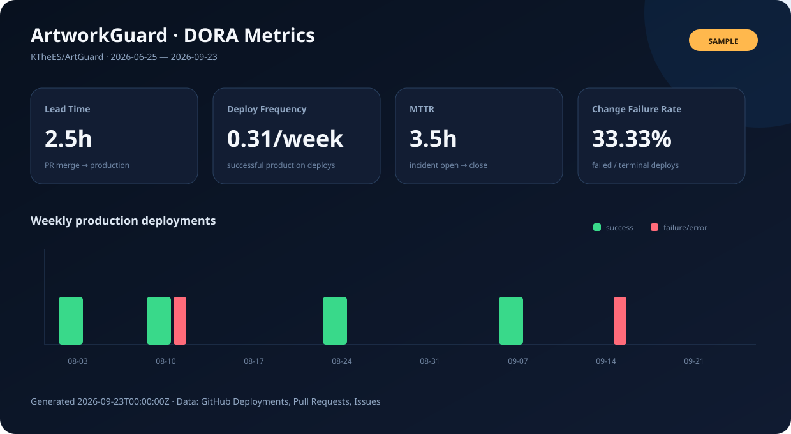

# ArtworkGuard

등록 작품을 주기적으로 비동기 검색하는 플랫폼입니다. STEP 26까지 백엔드 기능을 개발하고 STEP 27 정책 초안·STEP 28 MVP 차이 점검을 정리했습니다. MVP 웹 화면을 추가했으며 전체 연결 검증은 남아 있습니다.
탐지 결과는 사용자가 검토할 의심 후보이며 법적 판정이 아닙니다.

프로젝트 제안서, PRD, ERD와 학기 마일스톤은 별도의 [기획 문서 저장소](https://github.com/KTheES/copyright_detect)에서 관리합니다. 이 저장소는 실행 가능한 ArtworkGuard 애플리케이션 소스와 운영 자동화만 관리합니다.

작품 업로드와 로컬 MinIO 실행은 [STEP 3 안내](docs/STEP3_ARTWORK.md)를 참고하세요. 기본 실행에서는 저장소 연동이 비활성 상태입니다.

AI 실행은 [STEP 4 안내](ai-service/README.md), 비동기 저장 연결은 [STEP 5 안내](docs/STEP5_EMBEDDING.md)를 참고하세요.

## 구성

- `backend`: Java 21, Spring Boot 3.5.13, Gradle Wrapper 8.14.3
- PostgreSQL 17 + pgvector, Redis 7.4, Kafka 3.9.1: 로컬 Docker Compose
- Spring Security, JPA, Validation, Actuator, Flyway, Spring Kafka
- springdoc OpenAPI 2.8.17, JUnit, MockMvc, Testcontainers
- `ai-service`: FastAPI + CPU DINOv2, 768차원 정규화 벡터
- `frontend`: Node.js 22 기반 로컬 웹 앱 ([실행 안내](frontend/README.md)); `infra/terraform`: 후속 단계의 자리만 마련
- `docs/ArtworkGuard_Codex_Development_Plan.md`: 사용자 제공 원본 참고 문서

## 실행 (PowerShell)

Docker Desktop을 Linux 컨테이너 모드로 시작하고 JDK 21 이상을 준비합니다. 인증 실행에 필요한 JWT_SECRET 설정과 API 예시는 [STEP 2 안내](docs/STEP2_AUTH.md)를 참고하세요.
Gradle은 Java 21 toolchain이 없으면 다운로드합니다. 첫 실행에 인터넷이 필요합니다.

```powershell
Set-Location C:\copyright\_detect\_project
# 현재 PowerShell 세션에만 사용할 로컬 비밀번호 생성
$env:DB_PASSWORD = [guid]::NewGuid().ToString('N')
$env:REDIS_PASSWORD = [guid]::NewGuid().ToString('N')
# 기존 DB 볼륨을 다시 사용한다면 최초 설정한 비밀번호를 사용하세요.
$keyBytes = New-Object byte[] 32
$rng = [System.Security.Cryptography.RandomNumberGenerator]::Create()
$rng.GetBytes($keyBytes)
$rng.Dispose()
$env:JWT_SECRET = [Convert]::ToBase64String($keyBytes)
docker compose up -d --wait
Set-Location backend
.\gradlew.bat bootRun
```

Compose는 `.env`도 지원하지만 Spring Boot는 해당 파일을 자동으로 읽지 않습니다.
`.env`를 사용한다면 backend 실행 세션에도 동일한 DB_PASSWORD, REDIS_PASSWORD를 설정하세요.
`.env.example`은 키 목록만 제공하며 비밀번호를 포함하지 않습니다.

## 검증

```powershell
Set-Location C:\copyright\_detect\_project\backend
.\gradlew.bat test                 # Docker 없이 백엔드 단위 테스트
.\gradlew.bat integrationTest      # Docker 필수: 격리된 PostgreSQL, Redis, Kafka
.\gradlew.bat check bootJar        # 전체 검증 및 실행 jar 생성
Invoke-RestMethod http://localhost:8080/actuator/health
# 기대 응답: status = UP
Start-Process http://localhost:8080/swagger-ui.html
```

통합 테스트는 DB migration, pgvector 확장, Redis 읽기/쓰기, Kafka 연결,
Health/OpenAPI 접근, 미구현 API 차단을 확인합니다. Docker가 없으면 실패하며 건너뛰지 않습니다.
기본 Health는 PostgreSQL·Redis를 반영합니다. Kafka 연결은 통합 테스트와 Compose healthcheck로 확인합니다.

## 초기 설계

도메인별 패키지를 갖춘 모듈형 모놀리스로 시작합니다. Flyway V1은 vector 확장을, V2는 회원, V3는 작품·업로드 요청 테이블을 생성합니다. API 공통 응답은 `success/data/error/timestamp`입니다.
Actuator와 OpenAPI는 자체 응답 형식을 유지합니다.

Health·OpenAPI와 인증 진입 API는 공개하고 /auth/me는 Bearer JWT로 보호합니다. 쿠키 인증 없이 stateless로 동작하며 CSRF는 비활성화합니다.
작품 임베딩 작업에는 Kafka 소비자·재시도·DLT·Outbox를 적용했습니다. Mock 상품 수집·조회는 STEP 6에서 구현했습니다. AliExpress 연동 준비와 비동기 탐지 API는 구현했으며 실제 마켓 호출은 미검증입니다.
Kafka producer에는 idempotence와 제한된 delivery timeout을 설정했습니다.
로컬 서비스 포트와 API는 loopback에 바인딩하며 이 Compose는 상용 배포용이 아닙니다.

공식 호환성 참고: [Spring Boot](https://docs.spring.io/spring-boot/3.5/system-requirements.html),
[springdoc](https://springdoc.org/v2/).

## 다음 단계

MVP 웹 화면(로그인·작품 업로드·탐지 목록/상세)을 구현했습니다. [실행 및 검증 범위](frontend/README.md). [STEP 30 검증](docs/STEP30_LOCAL_VALIDATION.md): 백엔드·AI·웹 396개 테스트와 JAR 빌드 통과. Docker 시작 오류로 전체 연결 시험은 미완료이며, 다음 작업은 Docker 실행 환경 복구 후 통합·수용 시험입니다. [STEP 28 차이 점검](docs/STEP28_MVP_GAP_REVIEW.md)과 [수용 점검표](docs/MVP_ACCEPTANCE.md)에 우선순위와 완료 조건을 정리했습니다. [STEP 27 개인정보·법률 검토 준비](docs/STEP27_LEGAL_READINESS.md)에 내부 정책 초안·데이터 목록·삭제 절차와 미확정 사항을 정리했습니다. 정책 공개·법률 승인·물리 삭제 구현·운영 통합 검증은 미완료입니다. [STEP 26 감사 로그](docs/STEP26_AUDIT_LOG.md), 네이티브 앱 검증·악성코드 검사·OAuth, 실제 AI 평가·임계값 보정의 범위는 각 문서를 참고하세요.

STEP 24 API: [판매자 분석](docs/STEP24_SELLER_INTELLIGENCE.md). 본인 작품과 관리자 집계를 분리하고 탐지·창작자 수, 검토 우선순위, 최초·최근 탐지 시점을 제공합니다.

STEP 23 API: [신고 준비·수동 추적](docs/STEP23_TAKEDOWN_WORKFLOW.md). 확인된 탐지와 보존 증거 기반 초안, AliExpress 신고 링크, 수동 상태 기록과 감사 이벤트를 제공합니다.

STEP 22 도구: [검증 데이터 기반 임계값 비교](docs/STEP22_THRESHOLD_TUNING.md). validation 전용, 정밀도 제약, 데이터 부족 시 검토 후보 차단을 제공합니다. 운영 임계값은 변경하지 않았습니다.

## DORA 메트릭 자동화

[DORA Metrics 워크플로우](./.github/workflows/dora-metrics.yml)는 매주 월요일 오전 9시(KST)에 GitHub Deployments, Pull Requests, Issues를 조회하여 DORA 4대 지표를 계산합니다. Actions의 **Run workflow**에서 관측 기간, 운영 환경 정규식, incident 라벨을 지정해 수동 실행할 수도 있습니다.



- Lead Time for Changes: PR 병합부터 동일 SHA의 첫 운영 성공 배포까지
- Deployment Frequency: 관측 기간의 성공한 운영 배포를 주 단위로 환산
- Mean Time to Restore: `incident` 라벨 이슈 생성부터 종료까지의 평균
- Change Failure Rate: 실패·오류 운영 배포 ÷ terminal 운영 배포
- [대화형 Chart.js 대시보드](./dashboard/index.html)
- [최신 JSON](./reports/dora/latest.json) 및 [주간 보고서](./reports/dora/WEEKLY_REPORT.md)
- [산정 기준과 운영 가이드](./reports/dora/README.md)

현재 미리보기는 구조 확인용 **SAMPLE DATA**입니다. 첫 워크플로우 실행 후 이 저장소의 실측 결과로 교체됩니다. 정확한 수집을 위해 실제 배포 파이프라인은 GitHub Deployment Status를 남겨야 하며, 운영 장애는 `incident` 라벨 이슈로 기록해야 합니다.

아직 운영 배포 플랫폼이 연결되지 않은 경우 실제 배포가 끝난 후에만 [Record Production Deployment](./.github/workflows/record-production-deployment.yml)를 수동 실행합니다. 이 워크플로우는 배포 자체를 수행하지 않고 배포된 commit과 성공·실패 결과를 GitHub에 기록합니다.


## STEP 6 Mock Marketplace

구현 및 실행 방법: [STEP6_MARKETPLACE](docs/STEP6_MARKETPLACE.md). 기본 수집 비활성, 관리자만 실행 가능합니다.


## STEP 7 상품 이미지 임베딩

[STEP7_PRODUCT_EMBEDDING](docs/STEP7_PRODUCT_EMBEDDING.md): 상품 수집과 작업 등록, Kafka·S3·AI·pgvector 연결. EMBEDDING_ENABLED로 작품/상품 파이프라인을 함께 제어합니다.


## STEP 8 유사도 탐지

[STEP8_DETECTION](docs/STEP8_DETECTION.md): 작품 소유자 실행 API, pgvector cosine 비교, 상품별 결과 중복 제거 및 저장. 기본 기준은 0.75/0.85/0.92이며 설정으로 변경할 수 있습니다.


## STEP 9 탐지 검토 API

[STEP9_DETECTION_API](docs/STEP9_DETECTION_API.md): 본인 탐지 목록·상세·상태 변경, 필터·페이지 조회, 버전 기반 수정 충돌 방지.


## STEP 10 비동기 탐지

[STEP10_KAFKA](docs/STEP10_KAFKA.md): 탐지 POST는 이제 202와 작업 ID를 반환합니다. DETECTION_ENABLED=true로 Kafka 소비 및 임베딩 완료 기반 자동 탐지를 켭니다. STEP 8의 동기 응답 예시는 대체되었습니다.


## STEP 11 Redis 작업 보호

[STEP11_REDIS](docs/STEP11_REDIS.md): 수집 10회/분·탐지 요청과 재시도 30회/분 제한, 30초 검색 캐시, 60초 상품 중복 표시, 마켓 단위 잠금. Redis 장애 시 신규 수집/수동 탐지를 제한합니다.


## STEP 12 AliExpress 연동 준비

[STEP12_ALIEXPRESS](docs/STEP12_ALIEXPRESS.md): TOP 제휴 상품 검색 규격 기반 관리자 수집, 이미지 검증·S3 저장·임베딩 등록. 기본 비활성. 실제 키·계정 권한과 운영 호출은 미검증입니다.

## STEP 13 전체 + 영역 이미지 탐지

[STEP13_ADVANCED_IMAGE_DETECTION](docs/STEP13_ADVANCED_IMAGE_DETECTION.md): 상품 전체 이미지와 고정 겹침 영역 5개의 벡터를 함께 비교하고, 탐지 상세에 매칭 영역 좌표를 제공합니다.

## STEP 14 pHash/dHash 앙상블

[STEP14_PERCEPTUAL_HASH](docs/STEP14_PERCEPTUAL_HASH.md): 전체·영역별 64비트 pHash/dHash를 저장하고 DINOv2 유사도와 결합합니다. 상세 응답에는 각 점수와 앙상블 버전이 포함됩니다.

## STEP 15 Evidence System

[STEP15_EVIDENCE](docs/STEP15_EVIDENCE.md): 탐지 실행별 상품·판매자·가격·URL·이미지와 SHA-256을 불변 스냅샷으로 보존합니다.

## STEP 16 이메일 알림

[STEP16_NOTIFICATION](docs/STEP16_NOTIFICATION.md): HIGH·CRITICAL 탐지를 트랜잭션 큐에 저장하고 SMTP 작업자가 최대 5회 전송합니다. 기본 비활성입니다.

## STEP 17 자동 모니터링

[STEP17_MONITORING_SCHEDULER](docs/STEP17_MONITORING_SCHEDULER.md): 모니터링이 켜진 작품을 시간 버킷별로 순회하고 최대 100개씩 Kafka 탐지 작업에 등록합니다.

## STEP 18 구독

[STEP18_SUBSCRIPTION](docs/STEP18_SUBSCRIPTION.md): FREE·CREATOR·PRO·BUSINESS 플랜, 작품 수와 탐지 결과 한도, 플랜별 자동 스캔 주기·우선순위·이메일·증거 권한을 제공합니다.

## STEP 19 결제

[STEP19_BILLING](docs/STEP19_BILLING.md): Stripe Checkout, TRIAL·ACTIVE·PAST_DUE·CANCELED 상태, 원문 서명 검증과 중복·역순 이벤트에 안전한 웹훅 처리를 제공합니다. 기본 비활성입니다.

## STEP 20 운영 환경 강화

[STEP20_PRODUCTION_HARDENING](docs/STEP20_PRODUCTION_HARDENING.md): Stripe·AI 회로 차단, Checkout 요청 제한, 상태 변경 감사 기록, TLS·비밀값 마운트 운영 프로파일, DB 백업 검증 및 복구 절차를 제공합니다.

## STEP 21 AI 평가

[STEP21_AI_EVALUATION](docs/STEP21_AI_EVALUATION.md): 출처·권리·검토·분할 누수 검사, 합성 27쌍 fixture, 기본/고급 DINO 평가와 Precision·Recall·F1·FPR·FNR 보고서. 실제 hard negative 수집은 별도로 필요합니다.
