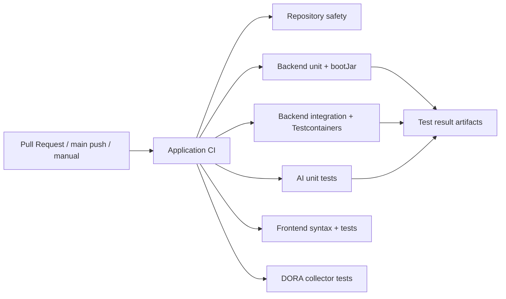

# STEP 35 애플리케이션 원격 CI

작성일: 2026-10-06. 상태: **구현 및 로컬 정적 검증 완료, GitHub Actions 최초 실행 대기**.

## 1. 결정 사항 및 배경 (ADR)

### 배경

[STEP 34 품질 게이트](STEP34_QUALITY_GATE_CHECKLIST.md)는 로컬 회귀 526개와 비기능 기준을 통과했지만, 애플리케이션 변경을 검증하는 원격 CI가 없어 R6을 `NOT_RUN`으로 유지했다. DORA 워크플로우는 지표 수집용이므로 애플리케이션 품질 게이트를 대신하지 않는다.

### 결정

`.github/workflows/application-ci.yml`을 추가하고 Pull Request, `main` push, 수동 실행에서 다음 작업을 병렬 실행한다.

- 저장소 민감 파일명 및 강한 비밀키 패턴 검사
- Java 21 백엔드 단위 테스트와 실행 JAR 빌드
- Docker/Testcontainers 기반 백엔드 통합 테스트
- Python 3.12 AI 서비스 비모델 테스트
- Node.js 22 프런트엔드 문법 및 회귀 테스트
- DORA 수집기 단위 테스트

워크플로우 권한은 `contents: read`만 부여하고 테스트 결과는 14일 보관한다. 실제 DINOv2 모델 시험은 약 350MB 모델 캐시와 별도 실행시간이 필요하므로 이번 PR 필수 게이트에서는 제외한다. 로컬 STEP 34의 실제 모델 결과를 대체하지 않으며, 추후 전용 캐시와 실행 예산을 정한 뒤 별도 주기 작업으로 추가한다.

### 검토한 대안

| 대안 | 판단 |
| --- | --- |
| 하나의 직렬 Job에서 전체 실행 | 느리고 실패 범위를 찾기 어려워 채택하지 않음 |
| DORA 워크플로우에 테스트 추가 | 지표 수집과 품질 검증 책임이 섞이므로 채택하지 않음 |
| 실제 AI 모델 시험까지 모든 PR에서 실행 | 다운로드 비용과 실행시간 정책이 확정되지 않아 보류 |

### 영향

- PR에서 구성요소별 실패 원인을 바로 확인할 수 있다.
- 통합 테스트는 GitHub 호스팅 Runner의 Docker 가용성에 의존한다.
- 원격 실행이 실제로 성공하기 전에는 STEP 34의 과거 `PARTIAL` 판정을 소급해 바꾸지 않는다.

## 2. 아키텍처 설계



각 Job은 독립 Runner에서 실행된다. 한 구성요소의 실패가 다른 구성요소의 진단 실행을 막지 않으며, 같은 PR의 이전 실행은 concurrency 정책으로 취소한다.

## 3. API 명세

이번 Step은 애플리케이션 HTTP API를 추가하거나 변경하지 않는다.

| 인터페이스 | 입력 | 출력 |
| --- | --- | --- |
| `pull_request` | PR의 head SHA | 구성요소별 Check Run과 테스트 아티팩트 |
| `push` | `main`에 반영된 SHA | 구성요소별 Check Run과 테스트 아티팩트 |
| `workflow_dispatch` | 실행할 Git ref | 동일한 전체 품질 게이트 |

기존 백엔드 API 명세는 실행 중 `/swagger-ui.html`, OpenAPI JSON은 `/v3/api-docs`에서 확인한다. CI에는 비밀값 입력이 없으며 저장소 기본 `GITHUB_TOKEN`도 명시적으로 사용하지 않는다.

## 4. 트러블슈팅 가이드

| 증상 | 확인 | 해결 |
| --- | --- | --- |
| Repository safety 실패 | 로그에 표시된 파일명만 확인하고 실제 비밀값은 출력하지 않음 | 비밀값을 폐기·교체하고 파일을 Git 이력에서도 제거할지 별도 판단 |
| Gradle 의존성 실패 | Maven Central 또는 Gradle 배포 서버 장애 여부 | 일시 장애면 재실행하며 버전을 임의로 낮추지 않음 |
| 통합 테스트 초기화 실패 | Docker/Testcontainers 로그와 실패한 컨테이너 확인 | 애플리케이션 실패와 Runner 인프라 실패를 구분해 기록 |
| AI 설치 실패 | Python 3.12 및 requirements 고정 버전 확인 | 의존성 갱신은 별도 PR에서 테스트 후 수행 |
| 아티팩트가 없음 | 테스트가 실행 전에 실패했는지 확인 | `if-no-files-found: warn` 로그와 선행 단계 오류를 함께 확인 |

로컬 재현 명령은 다음과 같다.

```powershell
Set-Location .\backend
.\gradlew.bat test bootJar --no-daemon
.\gradlew.bat integrationTest --no-daemon

Set-Location ..\ai-service
python -m pytest -q -m "not model"

Set-Location ..\frontend
node --check app.js
npm test

Set-Location ..
python -m unittest discover -s tests -p "test_*.py" -v
```

## 5. 회의 노트 및 액션 아이템

별도 회의는 없었다. 2026-10-06 사용자 요청과 STEP 34의 `R6 NOT_RUN`을 기준으로 원격 CI를 다음 우선 Step으로 결정했다.

| 항목 | 결정/담당 | 상태 |
| --- | --- | --- |
| 애플리케이션 CI 추가 | 개발 | 완료 |
| 민감정보 사전 검사 포함 | 개발 | 완료 |
| 최초 PR 원격 실행 확인 | 개발 | 대기 |
| 실제 모델 정기 CI 실행 정책 | 프로젝트 담당자 | 미정 |
| `main` 보호 규칙의 필수 Check 지정 | 저장소 관리자 | 원격 실행 확인 후 진행 |

### 로컬 검증 결과

| 검사 | 결과 |
| --- | --- |
| 백엔드 단위 테스트 + `bootJar` | PASS — 422개, 실패·오류·skip 0 |
| AI 비모델 테스트 | PASS — 70개, 모델 시험 3개 제외 |
| 프런트엔드 문법 + 회귀 | PASS — 6개 |
| DORA 수집기 | PASS — 4개 |
| 민감정보 강한 패턴 | PASS — 0건 |
| 백엔드 통합 테스트 | NOT_RUN — 로컬 Docker 엔진 중지, 원격 CI에서 실행 예정 |

로컬 합계는 502개다. 기존 STEP 34의 실제 모델 3개와 백엔드 통합 21개 결과를 소급 변경하지 않으며, 이번 변경의 원격 통합 성공 여부는 GitHub Actions 결과로 별도 판정한다.

## 6. FAQ 및 Onboarding

### CI는 언제 실행되나요?

모든 PR, `main` push, Actions의 수동 실행에서 동작한다.

### 실제 외부 서비스에 접속하나요?

아니다. 백엔드 통합 테스트는 Testcontainers의 격리 서비스와 fixture를 사용한다. AliExpress, 운영 SMTP/S3/Stripe 호출 성공을 의미하지 않는다.

### 비밀값을 Actions에 등록해야 하나요?

아니다. 이 워크플로우는 저장소 Secret을 요구하지 않는다. 실제 외부 연동은 별도 승인과 최소 권한 Secret 설계 후 추가한다.

### 신규 구성요소를 추가하면 무엇을 수정하나요?

독립 Job과 재현 명령을 추가하고, 실패 결과가 아티팩트로 남는지 확인한다. 문서에는 결정 배경, 아키텍처, 인터페이스, 트러블슈팅, 논의 기록, FAQ를 함께 갱신한다.

### 완료 판정은 언제 하나요?

PR의 모든 Application CI Job이 실제로 성공한 뒤에만 원격 품질 게이트를 `PASS`로 기록한다. 워크플로우 파일 존재만으로 통과 처리하지 않는다.
